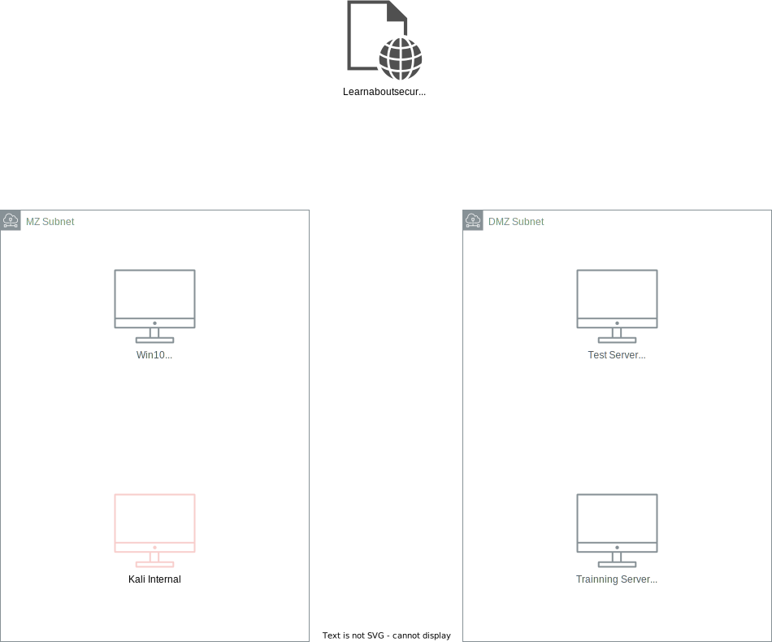

I. Overview

This project will take you on a journey through modern penetration tester and red teamer methodologies. This project will reinforce skills demonstrated throughout the course and challenge you to be efficient with documentation and testing efforts to generate a report in a timely fashion. The reporting process will also help the student understand the many business applications of security testing.

This includes:

1. Organizational Reconnaissance - Identifying where the organization's website is hosted, the platform on which it is hosted, and any DNS records of interest.
2. Network Scanning - The target company will provide a virtual machine intended for production point of sale and customer interaction. This virtual machine is to be scanned heavily to gather as much intelligence as possible.
3. Vulnerability and Exploit Research - You will spend time investigating software version discoveries for known vulnerabilities and any published exploit code.
4. System Exploitation - You will exploit two specific vulnerabilities on the system, though more exist. These vulnerabilities may compound on each other and lead to other mistakes made by the developers.
5. Produce a Meaningful Report - You will craft a single report that speaks to multiple audiences, some technical, and some non-technical. This report will include an executive summary, significant findings, and reproducible methodology.

II. Information about the system
1. Network investigation

2. Detailed information

III. Instruction
1. Recon
  - Checking public webpage (https://learnaboutsecurity.com/) information
    + [ x ] Search for the website on Shodan or other recon websites
    + [ x ] Discover the DNS information of the website
    + [ x ] Identify web technologies the website uses

2. Scanning
> You will need to complete vulnerability scans against the public website (learnaboutsecurity.com), the DMZ servers (DMZIServer and Debianx64DMZOnCloudNew), and the employee workstation (Win-10).

  + [ ] Scan for open ports
  + [ ] Scan for running services
  + [ ] Scan for sensitive files

> You also recall that there is sometimes a hidden folder that stores access credentials by default. You should be able to reveal sensitive data by:

  + [ ] Running a directory scan (dirb) against DMZIServer using the Udacity wordlist
  + [ ] Reveal root access to the DMZIserver

> Addition
  + [ ] Research software versions on all servers (Win 10, DMZI, Debian x64)

III. Exploitation
> 1 server has a vulnerability version of Xampp -> You need to exploit this and gain access to the target.
  + [ ] Gain access to the target through Xampp vulnerability (Maybe this vul is on the win10 machine)

> The SSH credentials for the payroll server (Debianx64DMZOnCloudNew) can also be cracked. From the course, we know the username is admin123, and we need to try and crack the password. Use the Hydra tool against the Udacity wordlist (/usr/share/wordlist/Udacity.txt) to crack the password and gain ssh access. If you are unsure what syntax to use to run the password crack, use the help (-h) command or research the world wide web.
  + [ ] Gain unauthenticated access to the employee workstation (win-10) by exploiting a vulnerable application. (XAMPP)
  + [ ] Crark the SSH root credentials to payroll server (Debianx64DMZOnCloudNew)

IV. Reporting
> We will need: 
1. Methodology
2. Screenhots
3. Documentation through the assessment.
4. The report should contains these sections:
  - Security Engagement Summary
    + Engagement Overview
    + Scope
    + Risk Analysis
    + Recommendations
  - Significant Vulnerabilities Summary
    + High-Risk Vulnerabilities
    + Medium Risk Vulnerabilities
    + Low-Risk Vulnerabilities
  - Significant Vulnerability Details

  - Appendix A: Security Analysis Methodology

    + Virtual Machine and Vulnerable Applications
    + Assessment Tools Selection
    + Red Team Operations Assessment
      * Reconnaissance
      * Scanning
      * Exploitation